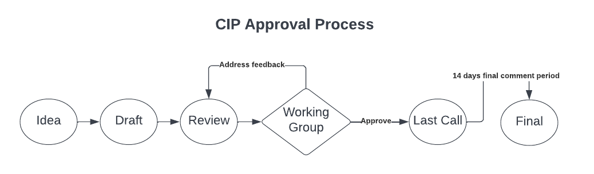
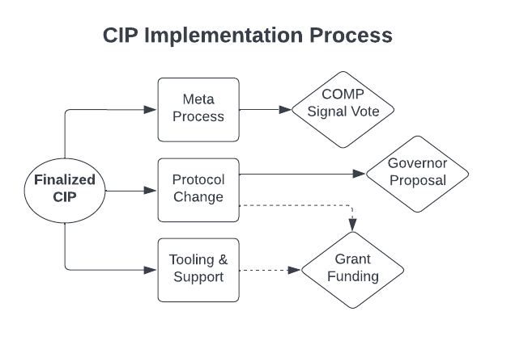

## Overview

A Compound Improvement Proposal (CIP) describes standards, processes and enhancements intended to improve the Compound Protocol. They can take the form of governance processes, on-chain enhancements, off-chain tooling or other goals that help Compound achieve objectives as a leading DeFi lending platform.

## CIP Rationale

CIPs are intended to be the default mechanism to improve Compound as both on-chain code and off-chain processes.

It’s important to note that CIPs are strictly separate from [Compound Governor Proposals](https://compound.finance/governance) and should not be considered a required prerequisite for submitting an on-chain proposal. Instead, CIPs are intended to define better processes for certain types of Governance Proposals in addition to serving as a way to solicit community feedback and acceptance on certain protocol enhancements before they are submitted on-chain.

Overall, CIPs serve as a collection point for improvement suggestions for the protocol. Community participants can also use CIPs to find contribution opportunities and even seek funding through grant committees and other support groups.

## CIP Types

There are three types of CIP:

1. **Meta Process** - describes any process to be adopted or modified to coordinate Compound governance, development, or community efforts
2. **Protocol Enhancement** - describes any change to the smart contracts that make up the Compound Protocol and Governor
3. **Tooling & Support** - describes any additions or improvements to off-chain infrastructure, tooling, documentation or other components that support the usage of the Compound protocol.

## CIP Lifecycle

CIP Authors will start out with an idea, draft that idea into a CIP document, request a peer review and then move through an approval process with the Compound Working Group. Ideas can be filed as issues on a commonly shared GitHub similar to [Ethereum PM](https://github.com/ethereum/pm/). CIPs can be drafted as PRs and then request review to be added to the agenda for the biweekly Working Group meetings.

CIP Editors will be selected from among core community contributors that will attend meetings regularly and provide feedback to CIPs. If any objections are raised to a CIP in its first meeting, it must address that feedback and then request another review in a future meeting. In a CIP’s second meeting, if there are no objections OR a majority of Editors are in favor, the CIP is approved and then remains in Last Call for 14 days before the implementation process begins.

Once past the Working Group, a CIP’s implementation path will diverge depending on its type. Meta Process CIPs will be approved by a majority Signal vote by COMP holders with no quorum after which they will become officially adopted as part of the Compound governance process that all COMP holders are expected to uphold. Other CIPs are left to the community to implement which can include funding to be approved by a Grant Committee or any other entity willing to support. Protocol Enhancements will also need to pass through a Compound Governance vote just as any other smart contract change would.

## What belongs in a successful CIP?

Each CIP should have the following parts:

* **Preamble** - RFC 822 style headers containing metadata about the CIP, including the CIP number, a short descriptive title (limited to a maximum of 44 characters), a description (limited to a maximum of 140 characters), and the author details.
* **Abstract** - Abstract is a multi-sentence (short paragraph) technical summary. This should be a very terse and human-readable version of the specification section. Someone should be able to read only the abstract to get the gist of what this specification does.
* **Motivation** - A motivation section should clearly explain why the existing protocol state is inadequate to address the problem that the CIP solves. 
* **Proposal Details **- One or more sections that thoroughly explain the technical solution and/or processes of the proposal . The specification should be detailed enough to allow for either a technical implementation or adoption of a governance process should the CIP be approved.
* **Rationale** - The rationale describes what motivated the CIP and why particular design or process decisions were made. It should include alternate designs/processes that were considered and related work, e.g. how the feature/process is implemented in other protocols. The rationale should discuss important objections or concerns raised during discussion around the CIP including technical and legal concerns.
* **Expected Impact** - The CIP's expected impact should list measurable results for how Compound will be improved by its implementation. It might also take note of negative trade-offs mentioned in the Rationale section and demonstrate here that they are outweighed by the positive effects.
* **Security Considerations** _(optional)_ - While not always required for “Meta Process” or “Tooling & Support” CIPs, every “Protocol Enhancement” must contain a section that discusses the security implications/considerations relevant to the proposed change.
* **Copyright Waiver** - All CIPs must be in the public domain. The copyright waiver MUST link to the license file and use the following wording: _Copyright and related rights waived via [CC0](/LICENSE)._

## CIP Formats and Templates

CIPs should be written in markdown format. There is a template to follow that will be established in a GitHub repository for tracking and approving all CIPs.

## CIP Editors

The current CIP editors are:

* Michael Lewellen (@cylon)
* Sriharsha Karamchati (@harsha)
* @Arr00
* Jared Flatow (@jared)
* Geoffery Hayes (@hayesgm)
* Kevin Cheng (@kevin)
* Duncan Dobbelmann (@Boardroom)
* @Dakeshi
* Michael Imperiale (@CL_Michael)

## CIP Editor Responsibilities

For each new CIP that comes in, an editor does the following:

* Read the CIP to check if it is ready: sound and complete. The ideas must make technical sense, even if they don’t seem likely to get to final status.
* The title should accurately describe the content.
* Check the CIP for language (spelling, grammar, sentence structure, etc.), markup (GitHub flavored Markdown), code style

If the CIP isn’t ready, the editor will send it back to the author for revision, with specific instructions.

Once the CIP is ready for the repository, the CIP editor will:

* Assign a CIP number (generally the PR number, but the decision is with the editors)
* Merge the corresponding pull request
* Send a message back to the CIP author with the next steps and ask they present the CIP in the next community call.
* The CIP editors monitor CIP changes, and correct any structure, grammar, spelling, or markup mistakes we see.

The editors don't pass judgment on CIPs. They merely do the administrative & editorial part. Editors may still voice either support or opposition to the CIP's claims of improving Compound but that should not factor into their decision-making criteria to approve a CIP. That will come down to the implementation phase where a CIP is left up to a Snapshot, Governance or Grant decision.

## History

This document was derived heavily from [Ethereum’s EIP-1](https://eips.ethereum.org/EIPS/eip-1), written by Martin Becze and Hudson Jameson, which in turn was derived from [Bitcoin’s BIP-0001](https://github.com/bitcoin/bips), written by Amir Taaki, which in turn was derived from [Python’s PEP-0001](https://peps.python.org/). In many places text was simply copied and modified. 

## Copyright

Copyright and related rights waived via [CC0](https://creativecommons.org/publicdomain/zero/1.0/).